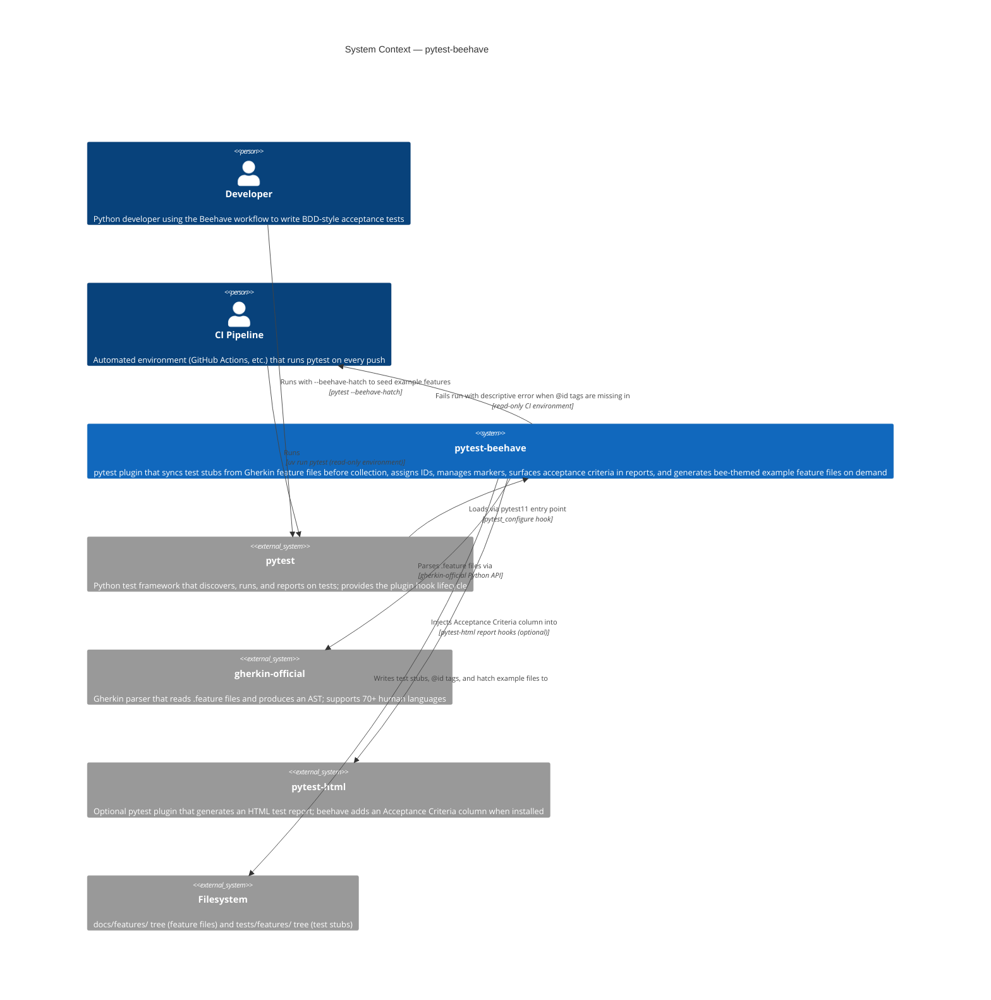

# C4 Level 1 — System Context: pytest-beehave

> Last updated: 2026-04-19 (v3.2 — stub-format-config)
> Source: docs/discovery.md, docs/features/completed/

## Notes

- **Developer** interacts with beehave indirectly: they write `.feature` files and run pytest; beehave auto-generates and maintains test stubs. They can also run `pytest --beehave-hatch` to generate a bee-themed example `docs/features/` tree showcasing all plugin capabilities.
- **CI Pipeline** is a read-only environment: beehave detects this and fails fast (with a clear error) instead of writing `@id` tags back.
- **gherkin-official** handles all language parsing, including non-English feature files (`# language: es`, `# language: zh-CN`, etc.). beehave delegates fully.
- **pytest-html** is an optional install extra (`pip install pytest-beehave[html]`); its absence is silently ignored.
- **`--beehave-hatch`** exits pytest immediately after generating example files — no test collection occurs. Use `--beehave-hatch-force` to overwrite existing content.
