# C4 Level 2 — Container: pytest-beehave

pytest-beehave is a single Python package installed as a pytest plugin. The "containers" here are the major modules with distinct responsibilities inside the package.

```mermaid
C4Container
    title Container Diagram — pytest-beehave (internal modules)

    Person(developer, "Developer", "Writes .feature files, runs pytest")
    Person(ci, "CI Pipeline", "Runs pytest in a read-only environment")

    System_Boundary(beehave, "pytest-beehave package") {
        Container(plugin, "plugin.py", "Python module", "pytest_configure entry point; orchestrates all plugin behaviour; injects Protocol adapters for filesystem and terminal writer")
        Container(config, "config.py", "Python module", "Reads [tool.beehave] from pyproject.toml via stdlib tomllib; returns a frozen BeehaveConfig dataclass with the resolved features_path")
        Container(bootstrap, "bootstrap.py", "Python module", "Ensures the three canonical subfolders (backlog/, in-progress/, completed/) exist; migrates root-level .feature files to backlog/ before stub sync")
        Container(feature_parser, "feature_parser.py", "Python module", "Delegates to gherkin-official to parse .feature files into ParsedFeature/ParsedExample domain objects; resolves @deprecated tag inheritance at parse time")
        Container(sync_engine, "sync_engine.py", "Python module", "Orchestrates stub sync across all three feature stages: creates new stubs, renames/orphan-marks changed stubs, runs deprecation sync, and generates missing @id tags")
        Container(stub_writer, "stub_writer.py", "Python module", "Writes and updates test stub functions using direct string manipulation; generates top-level test_<feature>_<@id> functions with docstrings")
        Container(stub_reader, "stub_reader.py", "Python module", "Reads existing test stub functions from test files; extracts function names, decorators, and docstrings via direct string parsing")
        Container(id_generator, "id_generator.py", "Python module", "Generates unique 8-character lowercase hex IDs scoped to the current .feature file; writes @id tags back inline")
        Container(reporter, "reporter.py", "Python module", "Formats and emits terminal output for bootstrap results and stub sync events via the PytestTerminalWriter Protocol adapter")
        Container(steps_reporter, "steps_reporter.py", "Python module", "Prints verbatim docstring steps below the test path at -v or above; scoped to tests under tests/features/ only")
        Container(html_steps_plugin, "html_steps_plugin.py", "Python module", "Adds an Acceptance Criteria column to the pytest-html report; registers only when pytest-html is installed; injects docstring content per feature test")
        Container(models, "models.py", "Python module", "Shared domain types: ParsedFeature, ParsedExample, FeatureStage, ExampleId, BootstrapResult, and Protocol definitions for FileSystem and TerminalWriter")
    }

    System_Ext(pytest, "pytest", "Host test framework providing the plugin hook lifecycle")
    System_Ext(gherkin, "gherkin-official", "Gherkin parser; supports 70+ human languages")
    System_Ext(pytest_html, "pytest-html", "Optional HTML report plugin")
    System_Ext(fs, "Filesystem", "docs/features/ tree (feature files) and tests/features/ tree (test stubs)")

    Rel(developer, fs, "Writes .feature files to; reads generated test stubs from")
    Rel(ci, pytest, "Runs pytest in read-only environment")
    Rel(pytest, plugin, "Calls pytest_configure hook on startup")
    Rel(plugin, config, "Reads features_path from pyproject.toml via")
    Rel(plugin, bootstrap, "Runs directory bootstrap via")
    Rel(plugin, sync_engine, "Triggers full stub sync via")
    Rel(plugin, steps_reporter, "Registers terminal steps hook via")
    Rel(plugin, html_steps_plugin, "Registers HTML column hook via (if pytest-html present)")
    Rel(bootstrap, fs, "Creates missing subfolders; migrates root-level .feature files in")
    Rel(sync_engine, feature_parser, "Parses .feature files via")
    Rel(sync_engine, stub_reader, "Reads existing test stubs via")
    Rel(sync_engine, stub_writer, "Creates and updates test stubs via")
    Rel(sync_engine, id_generator, "Generates and writes back missing @id tags via")
    Rel(sync_engine, reporter, "Emits terminal events via")
    Rel(feature_parser, gherkin, "Delegates .feature AST parsing to")
    Rel(stub_writer, fs, "Writes test stub files to tests/features/")
    Rel(stub_reader, fs, "Reads test stub files from tests/features/")
    Rel(id_generator, fs, "Writes @id tags back to docs/features/")
    Rel(steps_reporter, pytest, "Hooks into pytest_runtest_logreport")
    Rel(html_steps_plugin, pytest_html, "Hooks into pytest-html result row extra API")
```

## Notes

- All modules are part of a single deployable Python package (`pytest-beehave`). This diagram shows internal component boundaries for navigability.
- `models.py` defines the Protocol interfaces (`FileSystemProtocol`, `TerminalWriterProtocol`) used for dependency injection in tests.
- `plugin.py` is the only module that imports pytest internals directly; all others work on domain objects or Protocol abstractions.
- `stub_writer` and `stub_reader` use direct string manipulation (not a CST library) — sufficient for the structured stub format and carries zero additional runtime dependencies.
